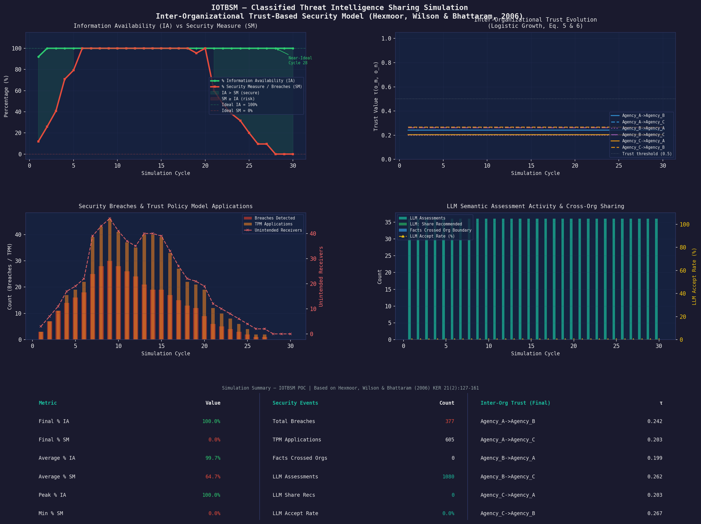

# IOTBSM POC

Proof-of-concept simulation for **inter-organizational trust-based sharing** of classified threat intelligence, based on:

- Hexmoor, H., Wilson, S., & Bhattaram, S. (2006), *A theoretical inter-organizational trust-based security model*, The Knowledge Engineering Review, 21(2), 127-161.

The project models three agencies exchanging intelligence through boundary spanners, tracks trust evolution, applies trust policy models after breaches, and generates a dashboard image per run.

## Sample dashboard



## What This POC Simulates

- **Analyst agents** create and consume intelligence facts inside each organization.
- **Boundary spanners (BS)** act as cross-organization gatekeepers.
- **Trust dynamics** evolve across intra-org, inter-org, and inter-BS relations.
- **Breach handling** applies one of three Trust Policy Models (TPM1/TPM2/TPM3).
- **Metrics** include Information Availability (IA), Security Measure (SM), breaches, sharing activity, and trust history.

## Repository Layout

- `main.py` - CLI entrypoint; runs simulation and writes dashboard.
- `simulation.py` - Main simulation loop and cycle/event metrics.
- `agents.py` - `AnalystAgent`, `BoundarySpannerAgent`, and `Organization`.
- `trust_model.py` - Trust relation storage and inter-org trust tracking.
- `trust_policy.py` - TPM implementations (TPM1, TPM2, TPM3).
- `fact_pedigree.py` - Fact model, categories/classification, pedigree audit.
- `llm_interface.py` - Mock LLM assessor used by boundary spanners.
- `visualization.py` - Dashboard generation (matplotlib).
- `experiment_parameters.md` - Suggested experiment matrix.

## Requirements

- Python 3
- Packages in `requirements.txt`:
  - `matplotlib`
  - `numpy`

Install:

```bash
python3 -m pip install -r requirements.txt
```

## Quick Start

Run with defaults:

```bash
python3 main.py
```

Run with explicit parameters:

```bash
python3 main.py \
  --cycles 30 \
  --tpm 1 \
  --seed 42 \
  --beta 5 \
  --delta 0.10 \
  --alpha 0.60 \
  --output ./out/iotbsm_dashboard.png
```

## CLI Parameters

- `--cycles` (int, default `30`): number of simulation cycles.
- `--tpm` (`1|2|3`, default `1`): trust policy model.
  - `1`: TPM1 - Proportional Responsibility
  - `2`: TPM2 - Uniform Responsibility
  - `3`: TPM3 - Initiator-Direct Reduction
- `--seed` (int, default `42`): random seed for reproducibility.
- `--beta` (int, default `5`): BS regulatory process rate.
- `--delta` (float, default `0.1`): trust decrement factor used by TPM.
- `--alpha` (float, default `0.6`): inter-org trust weighting factor.
- `--output` (path, default `./iotbsm_dashboard.png`): dashboard image path.

## Outputs

Each run prints:

- Parameter summary
- Event log summary (inter-org shares, breach count, sample breaches)
- Dashboard output location

Each run generates:

- A dashboard PNG containing IA/SM trends, trust evolution, breach/TPM activity, LLM activity, and sharing heatmap.

## Reproduce Baseline Figures

Run these three commands to generate baseline, paper-style TPM comparison figures with consistent parameters:

```bash
python3 main.py --cycles 30 --tpm 1 --seed 42 --beta 5 --delta 0.10 --alpha 0.60 --output ./out/baseline_tpm1.png
python3 main.py --cycles 30 --tpm 2 --seed 42 --beta 5 --delta 0.10 --alpha 0.60 --output ./out/baseline_tpm2.png
python3 main.py --cycles 30 --tpm 3 --seed 42 --beta 5 --delta 0.10 --alpha 0.60 --output ./out/baseline_tpm3.png
```

The resulting images in `./out/` give a direct TPM1 vs TPM2 vs TPM3 baseline comparison.

## Experiment Runs

Use the predefined campaign in:

- `experiment_parameters.md`

This includes baseline TPM comparisons, parameter sensitivity sweeps, and multi-seed robustness runs.

## Notes

- The LLM component is mocked in `llm_interface.py` for portability and repeatable experimentation.
- If matplotlib cache warnings appear in restricted environments, set `MPLCONFIGDIR` to a writable directory.
